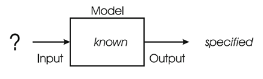
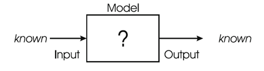
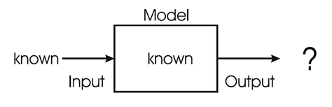

<!-- cSpell:disable -->
# Conceitos Básicos de Otimização

## Decidíveis x Indecindíveis
- Decidíveis: Problemas que podem ser resolvidos por alguma Máquina de Turing.
    - Problemas Decidíveis Tratáveis: São problemas que precisam de uma quantidade de tempo aceitável para serem resolvidos.
    - Problemas Decidíveis Intratáveis: São problemas os quais não existam algoritmos que possam resolver todas as instâncias do problema em um tempo razoável. **Tipo de problema objetivo de algoritmos de IA**
- Indecidíveis: Problemas que a Máquina de Turing não pode executar ou resolver.

## Estrutura de Sistema de Problemas

  
  
<em>Sistema de Otimização</em>

  
  
<em>Sistema de Modelagem</em>

  
  
<em>Sistema de Simulação</em>

## Função objetivo e Restrições
Uma função objetivo representa uma forma de associar um valor a uma possível solução e que reflete sua qualidade em uma escala. Em um provlema de otimização tenta-se maximizar ou minimizar o valor da função objetivo.

Uma restrição representa uma avaliação binária que diz se um dado requisito foi satisfeito ou não pela solução.

- COP: Constrained Optimization Problem
- CSP: Constraint Satisfaction Problem
- FOP: Free Optimization Problem

## Problema Mutiobjetivo
Problemas multiobjetivo envolvem mais de um objetivo a ser minimizado/maximizado.

O conjunto de soluções ótimas é chamado de Pareto Optimial Solution. 

- Solução não ótima de Pareto: Uma solução que pode ser melhorada sem prejudicar outra função objetivo
- Soluções não dominadas ou eficiente de Pareto: São soluções que não podem ser melhoradas sem prejudicar outras funções
- Pareto Optimal Front: Soluções não dominadas.

## Hill Climbing Algorithm
A pesquisa em escalada é um problema de pesquisa local. Ele baseia-se na técnica de busca **heurística** onde a direção da subida é estimada de forma que a função objetivo chegue ao pico mais alto.

## Tipos de Otimização
- Busca local (Exploitation): Refina a busca em uma região específica do espaço de soluções.
- Busca global (Exploration): Promove uma maior amplitude na busca por regiões promissoras.
- Métodos de solução única: Minimizam uma única solução a cada execução do algoritmo.
- Métodos baseados em população: Utilizam um conjunto de soluções (população) para realizar a busca no espaço de soluções.

**Algoritmos de construção** iterativamente o algoritmo monta/constrói uma solução para o problema.
**Algoritmos de melhoria** o algoritmo parte de uma possível solução do problema e tenta melhorá-la a cada iteração.

## Estratégias de Otimização
**Métodos determinísticos** que alcançam a solução por meio da aplicação direta de uma série de etapas definidas.
- **Análise direta;**
- **Gradiente descendente/ascendente;**
- **Enumeração exaustiva;**
- **Soluções heurísticas;**
**Métodos estocásticos** que introduzem algum nível de aleatoriedade durante a busca por uma solução.
- **Busca aleatória;**
- **Gradiente descendente estocástico**: Em vez de executar uma única iteração de descida de gradiente, que provavelmente terminará em um ótimo local, você pode executar muitas iterações do algoritmo enquanto inicia em um ponto diferente a cada vez.
- **Algoritmo de busca meta-heurística**: É uma classe de otimização que se baseiam em princípios estocásticos para resolver problemas complexos de otimização. Um conjunto de regras que orientam o processo de otimização para cada algoritmo, as regras são *meta-*, ao contrário dos métodos heurísticos, as abordagens meta-heurísticas são generalizáveis para qualquer problema de otimização. Algoritmos de busca meta-heurísitica possuem momentos de intensificação, onde a busca é local e diversificação, onde a busca é global.

> Heurísticas é uma abordagem que emprega um método prático que não é garantido como ótimo, perfeito ou racional, mas é suficiente para atingir uma meta ou aproximação. É utilizado em situações onde encontrar uma solução ótima é impossível ou impraticável.

> Abordagens puramente aleatórias são normalmente chamadas de métodos de Monte Carlo.

